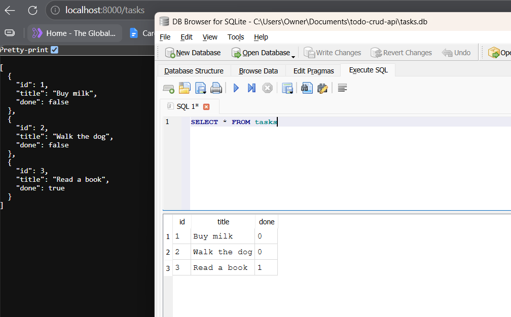
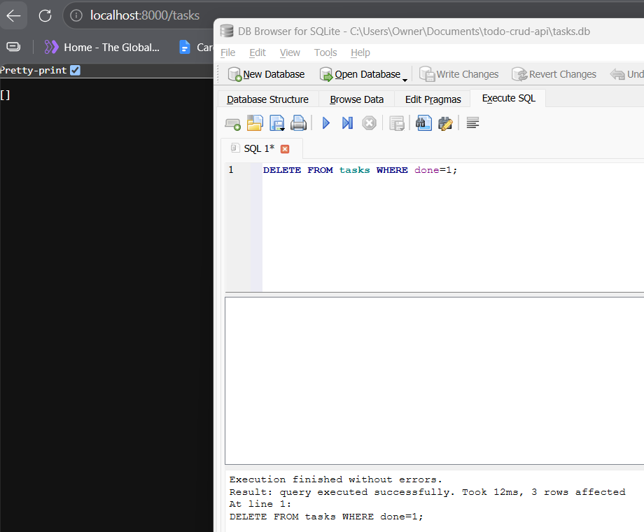
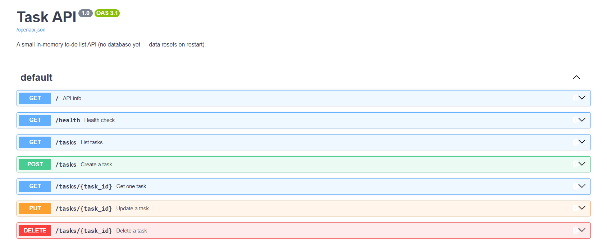

# Task API

A small to-do list CRUD API built with FastAPI. Tasks are stored in a SQLite database (`tasks.db`), so they survive server restarts.

## Install & run

Requires Python 3.10+.

```powershell
python -m venv .venv
.venv\Scripts\activate
pip install -r requirements.txt
```

Then start the server with one command:

```powershell
uvicorn main:app --port 8000
```

The API is now running at `http://localhost:8000`. Interactive docs (Swagger UI) are at `http://localhost:8000/docs`.

## Why SQLite

- **Single file**: the whole database is `tasks.db`, with no separate database server to install or run.
- **Zero setup**: `sqlite3` ships with Python, so there's nothing extra to install.
- **Survives restarts**: tasks are written to disk, unlike the in-memory list this API used before.

## The database file

- `tasks.db` lives next to `main.py` and is **created automatically** the first time the server starts.
- On startup the app creates the `tasks` table (`id`, `title`, `done`) if it's missing, and seeds three example tasks **only when the table is empty**, so restarts never duplicate them.
- `tasks.db` is git-ignored, so every fresh clone starts with just the three examples. Delete it at any time to reset.



## Endpoints

| Method | Path          | Description                        | Success | Errors                                  |
|--------|---------------|------------------------------------|---------|-----------------------------------------|
| GET    | `/`           | API info                           | 200     | —                                       |
| GET    | `/health`     | Health check                       | 200     | —                                       |
| GET    | `/tasks`      | List all tasks                     | 200     | —                                       |
| GET    | `/tasks/{id}` | Get one task                       | 200     | 404 unknown id                          |
| POST   | `/tasks`      | Create a task (`{"title": "..."}`) | 201     | 400 missing/empty title                 |
| PUT    | `/tasks/{id}` | Update a task's title and/or done  | 200     | 404 unknown id, 400 empty body or title |
| DELETE | `/tasks/{id}` | Delete a task                      | 204     | 404 unknown id                          |

Values of the wrong type (e.g. `"done": "yes"`) are rejected by FastAPI with 422.

## Example request

```
curl -i -X POST http://localhost:8000/tasks -H "Content-Type: application/json" -d '{"title":"Buy milk"}'
```

```
HTTP/1.1 201 Created
date: Fri, 11 Sep 2026 04:35:17 GMT
server: uvicorn
content-length: 40
content-type: application/json

{"id":4,"title":"Buy milk","done":false}
```

## Exploring the database

I opened `tasks.db` in DB Browser for SQLite and ran SQL by hand while the API was running.

```sql
DELETE FROM tasks WHERE done=1;
```

After marking every task done with `UPDATE tasks SET done=1;`, this query deleted all 3 rows ("3 rows affected"), and `GET /tasks` immediately returned `[]` with no server restart, because the API and DB Browser read the same file.



## Swagger UI


